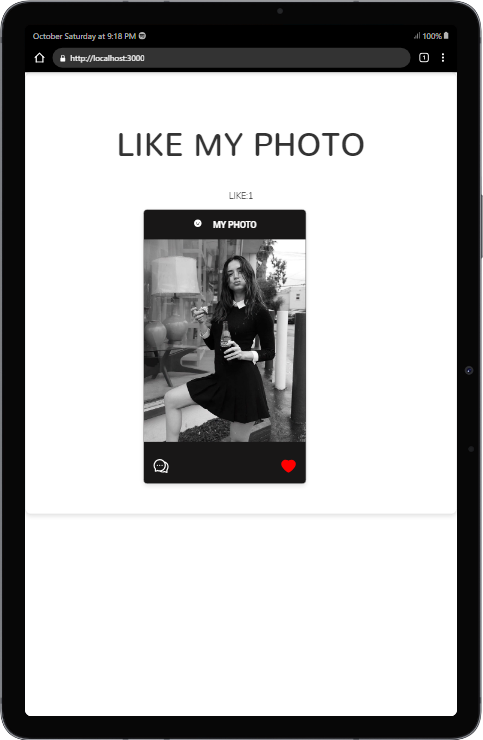

<div align="center">
  


</div>

# Like My Photo

This is a simple React app that allows users to like a photo. The app uses useState to track the state of the like button, and it uses the AiFillHeart and AiOutlineHeart icons from react-icons to render the like button.

## Getting Started

To get started, clone the repo and install the dependencies:

```
git clone https://github.com/your-username/like-my-photo.git
cd like-my-photo
npm install
```

Once the dependencies are installed, you can start the app by running:

```
npm start
```

The app will be available at http://localhost:3000.

## Code Explanation

The code for the app is located in the `src/app/LikeMyPhoto.jsx` file. The file starts by importing the necessary React and react-icons libraries.

```js
import React, { useState } from "react";
import Title from "../components/Title";
import {
  AiFillSmile,
  AiFillHeart,
  AiOutlineHeart,
  AiOutlineComment,
} from "react-icons/ai";
import girl from "../girl.jpg";
```

The `LikeMyPhoto` component is then defined. The component uses useState to track the state of the like button. The initial state of the like button is set to `false`.

```js
const [like, setlike] = useState(false);
```

The component also defines a `toggleLike` function. This function is called when the user clicks the like button. The function toggles the state of the like button.

```js
const toggleLike = () => {
  // if like is not true
  if (!like) {
    setlike(true);
  } else {
    setlike(false);
  }
};
```

The `render` method of the component returns the HTML for the app. The HTML includes a title, a card, and a like button.

```js
return (
  <main className="container m-top-2 " style={{ textAlign: "center" }}>
    <h1>
      {/* titel component */}
      <Title classes={"mb-4 title text-center"} title={" Like My Photo "} />
      <Title classes={"mb-4 subtitle text-center"} title={`LIKE:${count}`} />
      {/* card tages */})
```
